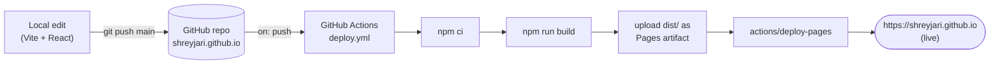
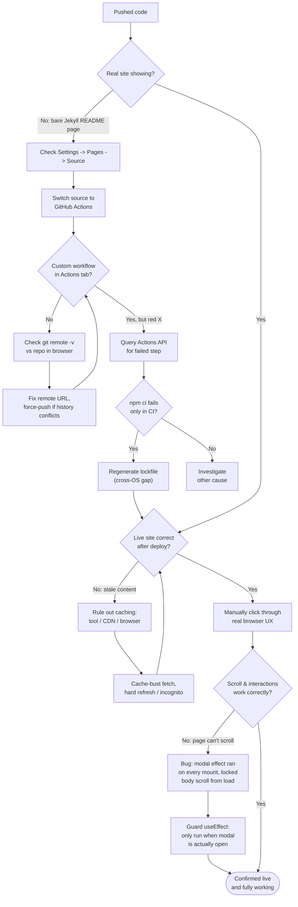

# Learning Log — Portfolio Build & Deploy

**Session outcome:** Built a React + Vite + Tailwind v4 portfolio from
scratch and shipped it to `https://shreyjari.github.io/` for free via
GitHub Pages + GitHub Actions. Confirmed live and working end to end.

This doc exists so the *next* time we stand up a static site like this,
we hit none of the below on the first try.

---

## 1. What got built

- React + Vite + Tailwind v4 single-page portfolio: hero, project grid
  (11 projects, each opening a modal with full story + a "nerdy details"
  toggle), toolbelt, "currently curious about," and a contact section
  (LinkedIn button + a visitor-submitted Formspree form — no personal
  contact info exposed on the page).
- Hosting: GitHub Pages, served at the **root domain**
  `shreyjari.github.io` (a "user site" repo, not a project subpath).
- Deployment: a custom GitHub Actions workflow
  (`.github/workflows/deploy.yml`) that runs `npm ci && npm run build`
  and publishes `dist/` — fully automatic on every `git push` to `main`.

## 2. How the pipeline works, end to end

Any future content or code change is just: edit → commit → push. No
manual build or upload step required.

## 3. Everything that went wrong, and the actual fix

We hit six distinct problems getting from "code exists locally" to "site
is actually correct and scrollable in a real browser." Chasing each one
down in order:

### Issue log

| # | Symptom | Root cause | Fix |
|---|---------|-----------|-----|
| 1 | `git push` succeeded, but Pages settings for the repo we were checking showed nothing new | `git remote` pointed at `shreyjari/portfolio.git`, a different repo than the one open in the browser (`shreyjari.github.io`) | `git remote set-url origin` to the correct repo URL |
| 2 | Live URL showed a bare "Shrey Jariwala / This site is open source. Improve this page." Jekyll page, even though an Actions run was green | GitHub Pages defaulted to **"Deploy from a branch,"** which runs GitHub's generic Jekyll build against the raw repo (it rendered `README.md`) — completely bypassing our Vite build. The green check belonged to GitHub's own `pages-build-deployment` workflow, not ours | `Settings → Pages → Source →` **GitHub Actions** |
| 3 | After fixing the remote, `git push` was rejected | Target repo was created on github.com with "Add a README" checked, giving it one unrelated commit with no shared history | Confirmed nothing worth keeping, then `git fetch origin` + `git push --force-with-lease` to overwrite it |
| 4 | Custom workflow now ran, but failed twice at `npm ci` with `EUSAGE` / `Missing: @emnapi/core`, `@emnapi/runtime` from lock file | `package-lock.json` was generated on Windows. Those two packages are transitive deps of the Linux/WASM-only optional variant of `@tailwindcss/oxide` — a known npm gap where a lockfile generated on one OS can under-describe another OS's optional-dependency subtree, which `npm ci` (strict) rejects | Deleted `package-lock.json` + `node_modules`, ran a clean `npm install`, verified the packages appeared and `npm ci` passed locally, committed the regenerated lockfile |
| 5 | Repeated "is it fixed yet?" checks kept showing stale/old content even after a real fix landed | Three independent caches stacked: the fetch tool's own ~15 min cache, GitHub Pages' Fastly CDN edge cache, and the user's browser cache | Cache-busted fetches with throwaway query params; verified ground truth via the Actions API (run status + head commit SHA) instead of trusting a single page load; hard refresh / incognito on the user's end |
| 6 | Site deployed correctly, but the live page couldn't scroll past the first row of project cards, and text near the top appeared to "shake" when scrolling was attempted | `ProjectModal`'s `useEffect` set `document.body.style.overflow = "hidden"` **unconditionally on mount** — it ran even when no project was selected, because the early `if (!project) return null` happens in the render body, *after* hooks already ran. Since the modal component never actually unmounts (it's always rendered, just returns `null`), the lock never cleared. The "shaking" was almost certainly the browser's rubber-band/overscroll bounce animation reacting to an unscrollable page | Added `if (!project) return;` as the first line inside the effect, so the scroll-lock only ever applies while a project is actually selected |

## 4. Lessons for next time (pre-flight checklist)

- [ ] **Before creating a new GitHub repo to receive existing local code:** create it *empty* — no README, no `.gitignore`, no license — to avoid a history clash on first push.
- [ ] **Before trusting a green checkmark in Actions:** check the workflow's *name*, not just pass/fail. GitHub's built-in `pages-build-deployment` and a custom workflow can both exist in the same repo and mean very different things.
- [ ] **Before debugging any GitHub Pages deploy issue:** confirm `Settings → Pages → Source` is set to **GitHub Actions**, not "Deploy from a branch" (the default for new repos).
- [ ] **Before assuming `git push` failures or wrong deploy targets are a settings problem:** run `git remote -v` and diff it against the exact repo URL open in the browser.
- [ ] **If `npm ci` fails only in CI, never locally:** suspect a cross-OS lockfile gap first, especially with any package that ships native/WASM platform variants (Tailwind v4's oxide engine, esbuild, Rollup, etc). Fix is almost always: delete `package-lock.json` + `node_modules`, fresh `npm install`, recommit. Ideally reproduce `npm ci` inside a Linux container/WSL locally *before* pushing, to catch this without burning CI cycles.
- [ ] **If a fix "should have worked" but the live site still looks old:** rule out caching layer by layer (fetch-tool cache → CDN edge cache → browser cache) before re-diagnosing the code.
- [ ] **Before shipping any modal/overlay component that toggles `body.style.overflow`:** guard the effect so it only touches global document state while the overlay is actually open — never let a hook that runs on every mount assume the component's visible state.
- [ ] **After a deploy looks "done":** actually click through the live site by hand (scroll, open a modal, close it) rather than stopping at "the build succeeded" or "the title tag looks right." Automated checks caught the deploy pipeline issues; only manual use caught the scroll-lock bug.

## 5. Outstanding items

Tracked as GitHub Issues + a dedicated GitHub Project board from here on,
instead of duplicated in this file:

- **Issues:** https://github.com/shreyjari/shreyjari.github.io/issues
- **Project board:** https://github.com/users/shreyjari/projects/2 ("Portfolio Site" — separate from the pre-existing "Project Tracker" board, which tracks unrelated work)

| Item | Issue |
|---|---|
| Wire up real Formspree ID for contact form | [#1](https://github.com/shreyjari/shreyjari.github.io/issues/1) |
| Delete or repurpose the stray `shreyjari/portfolio` repo | [#2](https://github.com/shreyjari/shreyjari.github.io/issues/2) |
| Add personal photo / avatar | [#3](https://github.com/shreyjari/shreyjari.github.io/issues/3) |

**Update cadence — deliberately not real-time:** the project board and
issue statuses are updated only at natural checkpoints — when a change is
verified complete and the user has confirmed it's working — not on every
intermediate edit during a work session. This keeps the board reflecting
"what's actually true" rather than churning with in-progress noise.

Already-resolved items (site deploy pipeline, scroll-lock bug) are
documented in the issue log above (Section 3) rather than as GitHub
Issues, since they're closed and the history lives here.
